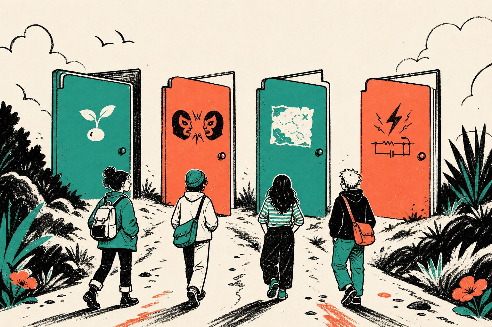

# Chantiers — Brain de Magma

> **Un sujet = un lieu.** On ferme des boucles. On peut tout refaire.

## Anatomie

Mode d’emploi : [`../workflow/en-clair.md`](../workflow/en-clair.md).  
**Rappel :** ces dossiers = **idées Brain** (`idée-brain`) ; un **outil Magma** nommé va dans [`../outils/`](../outils/).  
Focus / tags : [`../TRI.md`](../TRI.md). Étincelle avant chantier : [`../inbox/`](../inbox/).  
Gabarit seed : [`_gabarit-seed.md`](_gabarit-seed.md).

| Fichier | Job |
|---------|-----|
| `seed.md` | Pourquoi + slogan (+ nature / attention) |
| `debate.md` | Steelman |
| `map.md` | Carte — **absente = boucle ouverte** |
| `formula.md` | Formule + raisonnement |

## Index

| Chantier | Slogan |
|----------|--------|
| [paysage-outils-existants](paysage-outils-existants/) | Avant d’inventer, cartographier ce qui existe |
| [magma-plusieurs-outils](magma-plusieurs-outils/) | Pas un outil — une famille d’outils |
| [banc-essai-debats](banc-essai-debats/) | Des questions qui font débat — pas des outils |
| [une-porte-pas-tout](une-porte-pas-tout/) | Ne révolutionne pas… — déplie une phrase |
| [fiction-absurde](fiction-absurde/) | L’absurde désarme — puis la question reste |
| [histoires-fictions-partagees](histoires-fictions-partagees/) | Rendre l’histoire visible — sans en imposer une |
| [questions-sans-dogme](questions-sans-dogme/) | Se poser toutes les questions — surtout celles qu’on refuse |
| [machine-a-penser](machine-a-penser/) | Penser ensemble, agir ensemble |
| [structure-cerveau](structure-cerveau/) | Fermer des boucles, pas ouvrir des dossiers |
| [ton-empecheur](ton-empecheur/) | Titiller, pas cliquer |
| [simplicite](simplicite/) | Dsl, j'ai pas eu le temps de faire simple |
| [atlas-slogans](atlas-slogans/) | Machine à ralentir les slogans sans les tuer |
| [noyau-axiomes](noyau-axiomes/) | Penser par formules, sans être pensé par elles |
| [ia-interface](ia-interface/) | IA intégrée, pas collée |
| [science-wiki](science-wiki/) | Moins de papiers, plus de pages vivantes |
| [spectacle-desaccord](spectacle-desaccord/) | Plaisir avant l’effort |

## Transverse

[`../outils/`](../outils/) · [`../decisions/`](../decisions/) · [`../vision/`](../vision/) · [`../slogans/noyau/`](../slogans/noyau/) · [`../archive/graines/`](../archive/graines/)
