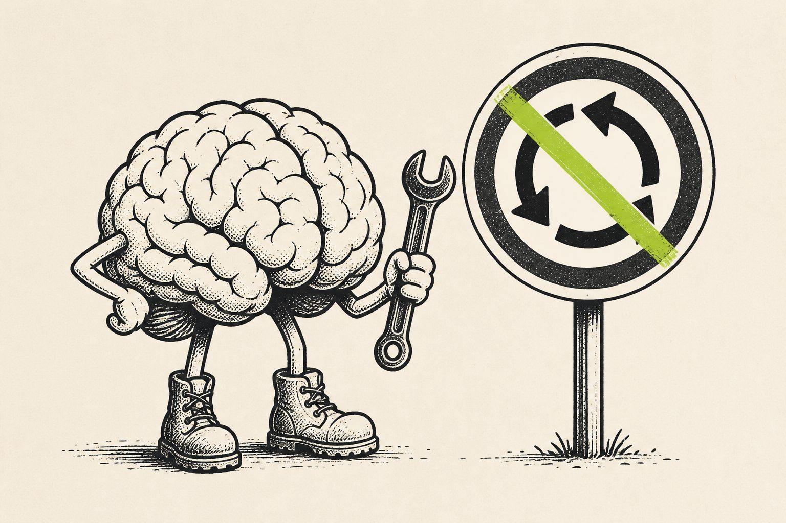

# Chantier : ton empêcheur

- **Statut** : actif · décision **0006 adoptée**
- **Illustration** : [`../../assets/illustrations/brain-empecheur.jpg`](../../assets/illustrations/brain-empecheur.jpg)

*Pas ici pour graisser le rond-point. Ici pour le démonter — poliment, mais pour de vrai.*

| Page | Lien |
|------|------|
| Graine | [`seed.md`](seed.md) |
| Débat | [`debate.md`](debate.md) |
| Carte | [`map.md`](map.md) |
| Formule | [`formula.md`](formula.md) |
| Guide | [`../../workflow/ton.md`](../../workflow/ton.md) |
